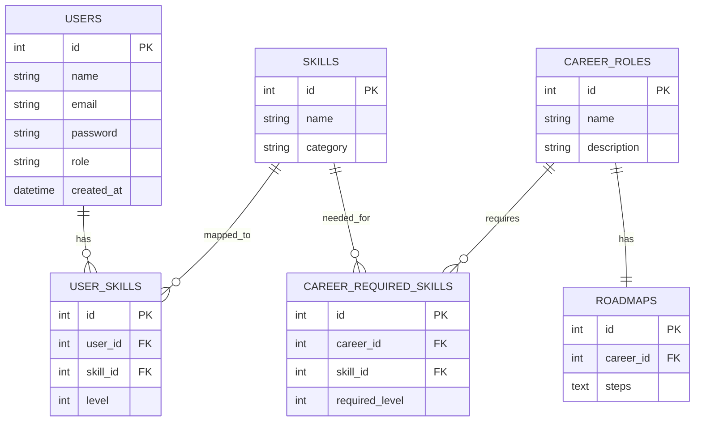

```mermaid
erDiagram
    USERS {
        int id PK
        string name
        string email
        string password
        string role
        datetime created_at
    }
    SKILLS {
        int id PK
        string name
        string category
    }
    USER_SKILLS {
        int id PK
        int user_id FK
        int skill_id FK
        int level
    }
    CAREER_ROLES {
        int id PK
        string name
        string description
    }
    CAREER_REQUIRED_SKILLS {
        int id PK
        int career_id FK
        int skill_id FK
        int required_level
    }
    ROADMAPS {
        int id PK
        int career_id FK
        text steps
    }
    USERS ||--o{ USER_SKILLS : has
    SKILLS ||--o{ USER_SKILLS : mapped_to
    CAREER_ROLES ||--o{ CAREER_REQUIRED_SKILLS : requires
    SKILLS ||--o{ CAREER_REQUIRED_SKILLS : needed_for
    CAREER_ROLES ||--|| ROADMAPS : has
```