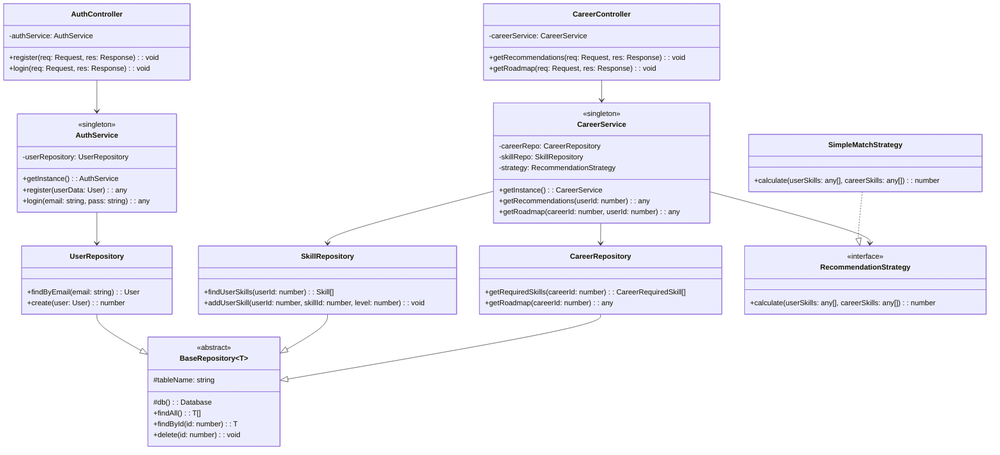

```mermaid
classDiagram
    %% Repositories (Inheritance)
    class BaseRepository~T~ {
        <<abstract>>
        #tableName: string
        #db(): Database
        +findAll(): T[]
        +findById(id: number): T
        +delete(id: number): void
    }

    class UserRepository {
        +findByEmail(email: string): User
        +create(user: User): number
    }

    class SkillRepository {
        +findUserSkills(userId: number): Skill[]
        +addUserSkill(userId: number, skillId: number, level: number): void
    }

    class CareerRepository {
        +getRequiredSkills(careerId: number): CareerRequiredSkill[]
        +getRoadmap(careerId: number): any
    }

    UserRepository --|> BaseRepository
    SkillRepository --|> BaseRepository
    CareerRepository --|> BaseRepository

    %% Services (Singleton & Polymorphism)
    class RecommendationStrategy {
        <<interface>>
        +calculate(userSkills: any[], careerSkills: any[]): number
    }

    class SimpleMatchStrategy {
        +calculate(userSkills: any[], careerSkills: any[]): number
    }

    SimpleMatchStrategy ..|> RecommendationStrategy

    class AuthService {
        <<singleton>>
        -userRepository: UserRepository
        +getInstance(): AuthService
        +register(userData: User): any
        +login(email: string, pass: string): any
    }

    class CareerService {
        <<singleton>>
        -careerRepo: CareerRepository
        -skillRepo: SkillRepository
        -strategy: RecommendationStrategy
        +getInstance(): CareerService
        +getRecommendations(userId: number): any
        +getRoadmap(careerId: number, userId: number): any
    }

    %% Controllers (MVC)
    class AuthController {
        -authService: AuthService
        +register(req: Request, res: Response): void
        +login(req: Request, res: Response): void
    }

    class CareerController {
        -careerService: CareerService
        +getRecommendations(req: Request, res: Response): void
        +getRoadmap(req: Request, res: Response): void
    }

    AuthController --> AuthService
    CareerController --> CareerService
    CareerService --> RecommendationStrategy
    CareerService --> CareerRepository
    CareerService --> SkillRepository
    AuthService --> UserRepository
```