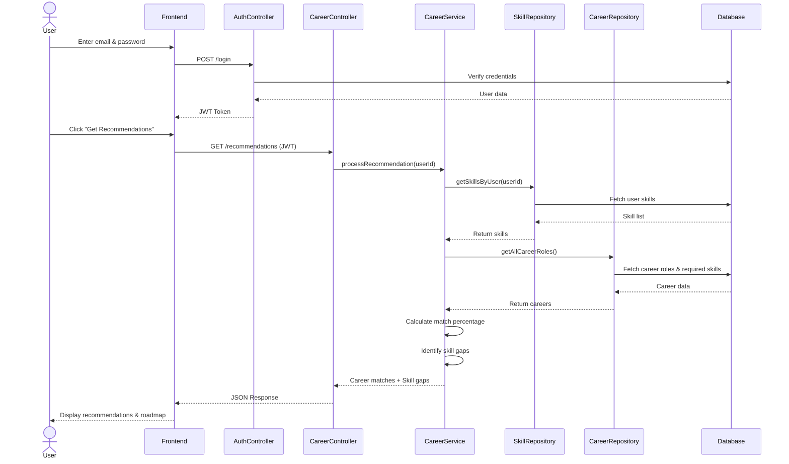

```mermaid
sequenceDiagram
    actor User
    participant Frontend
    participant AuthController
    participant CareerController
    participant CareerService
    participant SkillRepository
    participant CareerRepository
    participant Database
    User->>Frontend: Enter email & password
    Frontend->>AuthController: POST /login
    AuthController->>Database: Verify credentials
    Database-->>AuthController: User data
    AuthController-->>Frontend: JWT Token
    User->>Frontend: Click "Get Recommendations"
    Frontend->>CareerController: GET /recommendations (JWT)
    CareerController->>CareerService: processRecommendation(userId)
    CareerService->>SkillRepository: getSkillsByUser(userId)
    SkillRepository->>Database: Fetch user skills
    Database-->>SkillRepository: Skill list
    SkillRepository-->>CareerService: Return skills
    CareerService->>CareerRepository: getAllCareerRoles()
    CareerRepository->>Database: Fetch career roles & required skills
    Database-->>CareerRepository: Career data
    CareerRepository-->>CareerService: Return careers
    CareerService->>CareerService: Calculate match percentage
    CareerService->>CareerService: Identify skill gaps
    CareerService-->>CareerController: Career matches + Skill gaps
    CareerController-->>Frontend: JSON Response
    Frontend-->>User: Display recommendations & roadmap
```