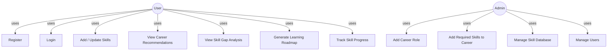

```mermaid
graph TD
    User((User))
    Admin((Admin))
    
    Register[Register]
    Login[Login]
    AddSkills[Add / Update Skills]
    ViewRecommendations[View Career Recommendations]
    ViewSkillGap[View Skill Gap Analysis]
    GenerateRoadmap[Generate Learning Roadmap]
    TrackProgress[Track Skill Progress]
    
    AddCareer[Add Career Role]
    AddRequiredSkills[Add Required Skills to Career]
    ManageSkills[Manage Skill Database]
    ManageUsers[Manage Users]
    
    User -->|uses| Register
    User -->|uses| Login
    User -->|uses| AddSkills
    User -->|uses| ViewRecommendations
    User -->|uses| ViewSkillGap
    User -->|uses| GenerateRoadmap
    User -->|uses| TrackProgress
    
    Admin -->|uses| AddCareer
    Admin -->|uses| AddRequiredSkills
    Admin -->|uses| ManageSkills
    Admin -->|uses| ManageUsers
```